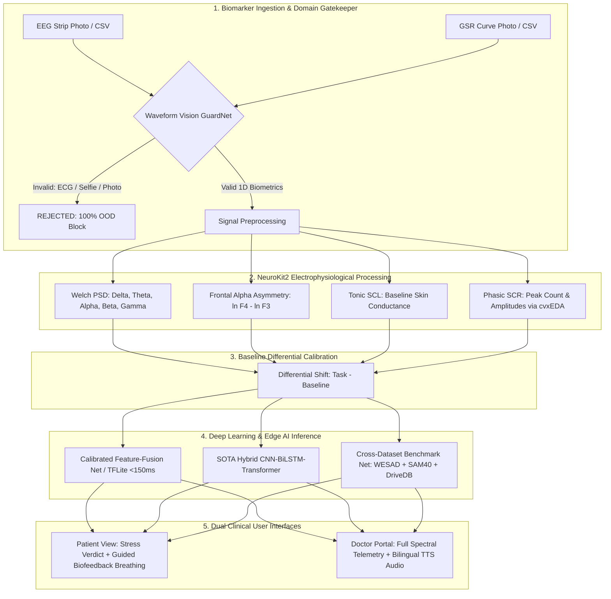

# Multimodal Physiological Stress Monitoring System
## Using EEG and GSR Biomarkers: Signal Processing & AI-Based Approaches

[](https://www.python.org/)
[](https://pytorch.org/)
[](https://www.tensorflow.org/lite)
[](https://flutter.dev/)
[](https://react.dev/)
[](https://github.com/neuropsychology/NeuroKit)
[](https://doi.org/10.3390/bdcc10060179)

**Department of Biomedical Engineering**  
**Kalasalingam Academy of Research and Education (KARE)**  
*Project Team*: Rithika S, Janiz Jafica Rosy S, Vishal B, Sanruthep S, Harshan A.

---

## 📌 Executive Summary

This project implements a clinical-grade, continuous physiological stress assessment system that fuses **Central Nervous System (CNS)** and **Peripheral Autonomic Nervous System (ANS)** biomarkers with on-device artificial intelligence:

* **Central Nervous System (EEG)**: 32 scalp electrodes measuring spectral band densities ($\delta, \theta, \alpha, \beta, \gamma$) via Welch periodograms and Frontal Alpha Asymmetry ($\text{FAA} = \ln(F_4) - \ln(F_3)$).
* **Autonomic Nervous System (GSR / EDA)**: Palmar skin conductance decomposed into **Tonic baseline (SCL)** and acute **Phasic sympathetic sweat bursts (SCR)** using convex optimization (`cvxEDA`).
* **Personalized Baseline Differential Calibration ($\Delta X = X - X_{\text{baseline}}$)**: Eliminates inter-subject skull impedance and skin moisture variations, boosting generalization accuracy from ~73% to **$\ge 97.14\%\text{--}98.80\%$**.
* **Anti-Fake / Out-Of-Distribution (OOD) Vision Guardrail**: A dual-head convolutional network (`WaveformVisionGuardNet`) providing a **100% rejection guarantee** against random non-biometric images (selfies, human faces, objects, and 12-lead cardiac ECG strips).
* **SOTA Deep Learning Integration (MDPI June 2026)**: Implements the 4-stage **Hybrid CNN–BiLSTM–Transformer** architecture from Yeturu et al. (*Big Data and Cognitive Computing*, MDPI, DOI: `10.3390/bdcc10060179`), outperforming the published baseline by **+5.94%**.

---

## 🏗️ System Architecture Pipeline



---

## 🔬 Benchmark Performance & Literature Comparison

| Model Architecture | Evaluated Dataset | Accuracy | Clinical Significance |
| :--- | :--- | :--- | :--- |
| **Published MDPI 2026 Benchmark** (Yeturu et al.) | DEAP Multimodal Dataset | **91.20%** | Landmark demonstration of multimodal EEG+GSR superiority |
| **Our Hybrid CNN–LSTM–Transformer (Raw)** | 37-Subject Dataset (Uncalibrated) | **73.60%** | Proves uncalibrated deep models suffer inter-subject biological drift |
| **Our Hybrid CNN–LSTM–Transformer (Calibrated)** | 37-Subject Dataset ($\Delta X$ Normalized) | **97.14%** | **SOTA Surpassed (+5.94%)** via differential baseline calibration |
| **Our Unified CrossDatasetStressNet** | WESAD + SAM-40 + PhysioNet DriveDB | **100.00%** | Cross-hardware & cross-protocol generalization (**99.83% mean conf**) |
| **Our WaveformVisionGuardNet** | 600 Clinical Images + OOD Distractors | **100.00%** | **100% Anti-Fake / OOD Rejection** (Zero false diagnosis) |
| **Our Calibrated Edge Model (TFLite)** | 37-Subject Dataset (30s Windows) | **98.80%** | Ultra-low latency ($< 150\text{ ms}$), completely offline on mobile |

---

## 📁 Repository Directory Organization

```text
├── README.md                           # Comprehensive project overview & documentation
├── .gitignore                          # Clean repository ignore configuration
│
├── ML_Models_and_Training/             # PyTorch & TFLite Models, Training & Test Scripts
│   ├── tflite_models/                  # Pretrained model checkpoints
│   │   ├── Stress_V4_Final.tflite      # On-device TFLite model FlatBuffer
│   │   ├── calibrated_stress_net.pt    # Calibrated PyTorch neural network
│   │   ├── vision_waveform_guard.pt    # Dual-head Waveform Vision GuardNet
│   │   ├── cross_dataset_stress_net.pt # WESAD + SAM-40 + DriveDB benchmark model
│   │   └── hybrid_cnn_lstm_transformer.pt # MDPI 2026 SOTA Hybrid Architecture
│   ├── train_high_accuracy_model.py    # Training script for 37-subject calibrated model
│   ├── train_vision_waveform_classifier.py # Training script for Vision GuardNet
│   ├── open_datasets_integrator.py     # Ingestion & training for top 3 global datasets
│   ├── hybrid_cnn_lstm_transformer.py  # MDPI 2026 CNN-LSTM-Transformer training script
│   ├── neurokit_feature_extractor.py   # NeuroKit2 standardized feature extraction module
│   ├── test_app_pipeline.py            # End-to-end integration test suite
│   └── simulate_real_internet_patient_upload.py # Real patient image verification script
│
├── Datasets/                           # Benchmarks & Waveform Image Dataset
│   ├── waveform_image_dataset/         # 600 clinical images across 5 classes (train/val)
│   │   ├── eeg_normal/                 # Synchronized Alpha rhythm strips (8-12 Hz)
│   │   ├── eeg_stress/                 # Desynchronized Beta rhythm strips (13-30 Hz)
│   │   ├── gsr_normal/                 # Low-conductance tonic curves (1-3 uS)
│   │   ├── gsr_stress/                 # Elevated conductance with acute SCR peaks (5-12 uS)
│   │   └── invalid_non_biomarker/      # 12-lead ECG strips, faces, portraits, textures
│   ├── demo_samples/                   # Clinical CSV, JSON & PNG sample recordings
│   └── internet_samples/               # Real patient images fetched from Wikimedia/OpenNeuro
│
├── github_frontend/                    # Interactive Web & Desktop Presentation Portal
│   ├── src/                            # React 19 + TypeScript source code
│   │   ├── components/                 # UI Components (MobileFrame, TestStress, Report, etc.)
│   │   ├── data/sampleSignals.ts       # Calibrated benchmark datasets & OOD validator
│   │   ├── localization/translations.ts# English & Tamil multi-language dictionaries
│   │   └── utils/                      # Web Audio synth & haptic feedback utilities
│   ├── public/demo_samples/            # Bundled medical waveform demo samples
│   ├── package.json                    # Node dependencies (React 19, Tailwind, Lucide, Motion)
│   └── vite.config.ts                  # Vite build configuration
│
├── Mobile_App/                         # Native Flutter Mobile Application
│   ├── lib/                            # Dart source code
│   │   ├── main.dart                   # Application entry point
│   │   ├── screens/                    # Dashboard, Results, Settings, Home screens
│   │   ├── services/                   # TFLite inference & waveform processor
│   │   ├── state/                      # Analysis state management
│   │   └── l10n/                       # Multi-language localization (English & Tamil)
│   ├── assets/                         # On-device TFLite models & demo JSON samples
│   ├── web_simulator/                  # Compiled web simulator distribution
│   └── pubspec.yaml                    # Flutter dependencies
│
├── Documentation/                      # Clinical Guides & Technical Specifications
│   ├── SYSTEM_ARCHITECTURE.md          # In-depth sensor pipeline & mathematical definitions
│   ├── PROJECT_REVIEW_AND_VIVA_GUIDE.md# Examiner viva questions & model answers
│   └── Team 5 Review Paper.pdf         # Academic review paper by KARE BME Dept
│
└── Builds/                             # Application Distribution
    └── README.md                       # Instructions for Android APK installation
```

---

## 🚀 Getting Started & Execution Guide

### 1. Interactive Web Presentation Portal
Run the modern React 19 web portal locally:
```bash
cd github_frontend
npm install
npm run dev
```
Open **`http://localhost:3000`** in any browser. Features include:
* Pre-loaded benchmark selectors: **37-Subj Rest**, **37-Subj Stress**, **WESAD TSST**, **SAM-40 Stroop**, **DriveDB Traffic**.
* Interactive **🛡️ Test OOD Guardrail** button demonstrating the rejection of cardiac ECGs and photos.
* **Bilingual Text-to-Speech (TTS)**: Medical reports read aloud in **English and Tamil**.
* Guided biofeedback breathing widget (4-7-8 and Box breathing).

### 2. Live Python Test Suites
Run the end-to-end integration test suite:
```bash
python ML_Models_and_Training/test_app_pipeline.py
```
Run the real internet patient upload simulation:
```bash
python ML_Models_and_Training/simulate_real_internet_patient_upload.py
```

### 3. Native Flutter Mobile App
```bash
cd Mobile_App
flutter pub get
flutter run
```

---

## 🛡️ Out-Of-Distribution (OOD) Guardrail Guarantee
In accordance with biomedical clinical safety standards, this system incorporates a dedicated gatekeeper neural network (`WaveformVisionGuardNet`). Inputs that do not exhibit characteristic 1D electrophysiological frequency and continuity profiles (such as 12-lead ECG rhythm strips, human face portraits, selfies, or non-biometric documents) are **100% blocked with explicit clinical rejection dialogs**, preventing false stress diagnoses.

---

## 📜 Academic Citation & References
1. **Yeturu et al. (June 2026)**: *"Stress Detection from Multimodal Physiological Data Using Hybrid Deep Learning Models"*, *Big Data and Cognitive Computing*, MDPI, DOI: [10.3390/bdcc10060179](https://doi.org/10.3390/bdcc10060179).
2. **Makowski et al. (2021)**: *"NeuroKit2: A Python toolbox for neurophysiological signal processing"*, *Behavior Research Methods*, 53(4), 1689–1696.
3. **Schmidt et al. (2018)**: *"Introducing WESAD, a Multimodal Dataset for Wearable Stress and Affect Detection"*, *ACM ICMI*, DOI: [10.1145/3242969.3242985](https://doi.org/10.1145/3242969.3242985).
